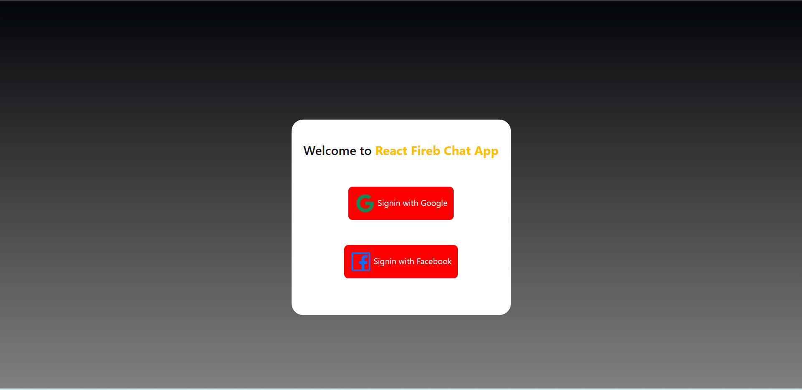

## React Fireb Chat App

This is a simple chat application built using React, Firebase and Chat Engine.

### Installation

To install the necessary dependencies, run the following command:

```
npm install
```

### Running the app

To start the app, run the following command:

```
npm start
```

### Dependencies

This project uses the following dependencies:

- `@ant-design/icons`: for icon library
- `axios`: for HTTP requests
- `bootstrap`: for styling
- `firebase`: for authentication and database
- `react`: for building user interfaces
- `react-bootstrap`: for styling
- `react-chat-engine`: for chat engine functionality
- `react-dom`: for rendering
- `react-router-dom`: for routing
- `react-scripts`: for running and building the app
- `web-vitals`: for performance metrics

### Usage

The app has two main components: `Login` and `Chats`.

The `Login` component handles user authentication and login.

The `Chats` component displays the chat room and messages.

### Screenshorts



## Visit the page
To see the live project, click [here](#).

